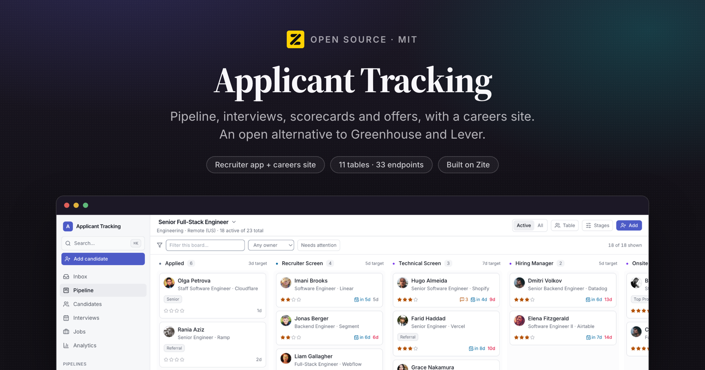
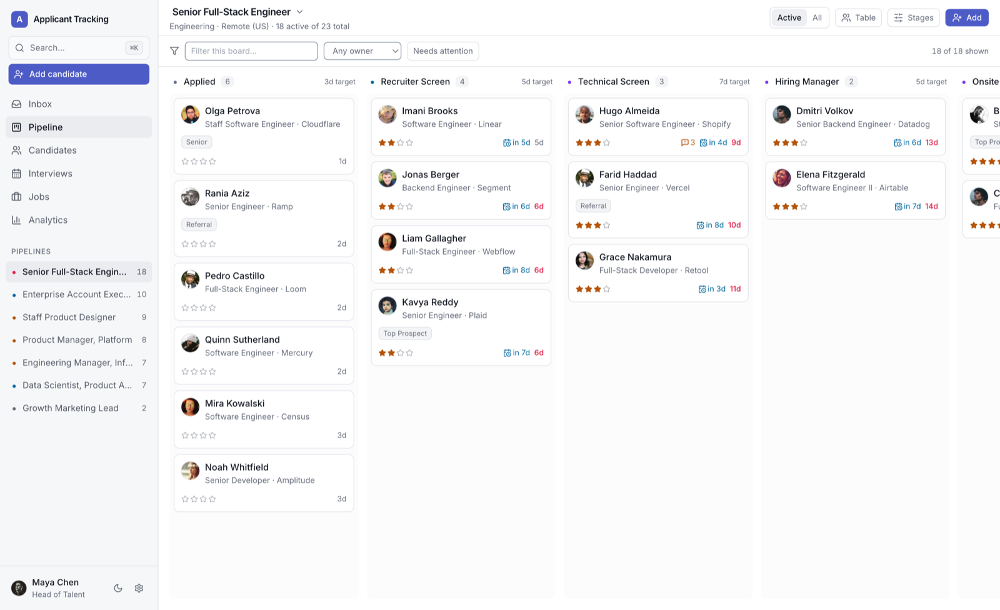
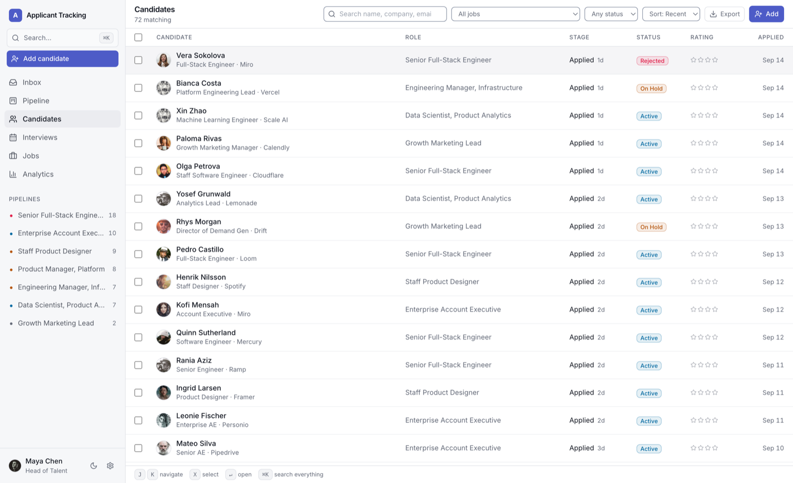
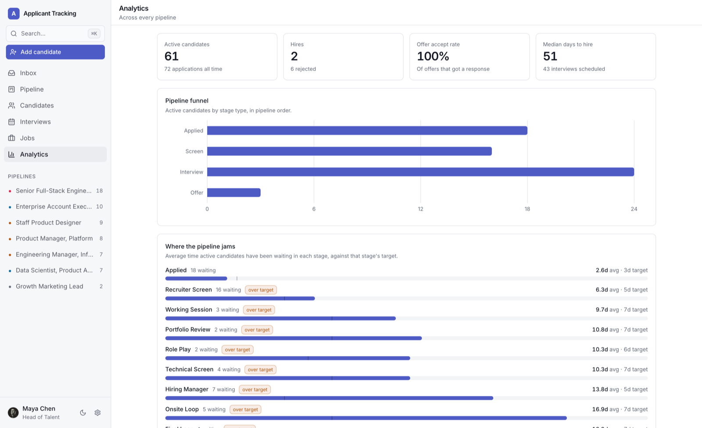

<p align="center">
  
</p>

<h3 align="center">Applicant Tracking</h3>

<p align="center">
  Open-source applicant tracking: pipeline, interviews, scorecards and offers,
  <br/>
  with a public careers site. An open alternative to <b>Greenhouse</b> and <b>Lever</b>.
</p>

<p align="center">
  <a href="#the-daily-loop">Features</a> ·
  <a href="#install-it-in-your-own-workspace">Install</a> ·
  <a href="#how-it-works">How it works</a> ·
  <a href="#local-development">Development</a> ·
  <a href="https://developers.zite.com">Zite docs</a>
</p>

<p align="center">
  <a href="LICENSE"></a>
  <a href="https://github.com/zite/applicant-tracking/stargazers"></a>
  <a href="https://www.npmjs.com/package/zitejs"></a>
</p>

---

## What this is

An applicant tracking system for a hiring team, with the careers site candidates
apply through.

This is a **Zite solution**, meaning a workspace you install into your own
[Zite](https://zite.com) account and then edit. Zite provides the Postgres
database, the endpoint runtime, auth and hosting. Everything above that is the
~20,000 lines of TypeScript in this repository.

Two apps share one database:

| App | Directory | Who uses it | Access |
| --- | --- | --- | --- |
| **Applicant Tracking** | `apps/applicant-tracking` | Recruiters and hiring managers: pipeline board, candidate profiles, interviews and scorecards, offers, email, analytics | Internal (organization members) |
| **Careers Site** | `apps/careers-site` | Candidates: the public job list and application form | External (public) |

Both are seeded with a realistic demo workspace on first open, so the template is
never evaluated against empty screens. The fictional employer in that demo data is
Northwind Labs.

<p align="center">
  
</p>

---

## The daily loop

**Inbox** is the landing screen and the reason the app is worth opening: feedback
you owe, interviews in the next three days, new applications nobody has reviewed,
candidates stalled past their stage target, and offers waiting on an approval.
Every row goes straight to the thing that needs doing.

From there: **Pipeline** is the board (drag to move, with undo, plus filtering by
owner or by what needs attention); **Candidates** is the cross-job table with
multi-select bulk triage, move, assign, rate, reject with a reason and an
optional email, and CSV export of whatever is on screen; **Interviews** is the
schedule; **Analytics** covers the funnel, sources, velocity and where the
pipeline actually jams; **Settings** manages integrations, the hiring team and
email templates.

<p align="center">
  
</p>

Candidates can be added by hand for sourcing, and a person who applies to two
roles is one record with both applications visible from either.

## Data model

Eleven tables. `Applications` is the centre of gravity, it joins a `Candidate` to
a `Job` at a `Stage`, and everything else hangs off it.

```
Jobs ──< Stages
  │         │
  └──< Applications >── Candidates
          │  │  │
          │  │  └──< Email Messages
          │  └─────< Activities          (feed + audit trail)
          └───────< Interviews ──< Scorecards
          └───────< Offers
Team Members ── hiring manager / recruiter / interviewer / owner / author
Email Templates                          (standalone)
```

Stages belong to a job, so each pipeline is independent and can be renamed,
reordered or retargeted from the board without touching another role. Stage
**kind** (`Applied`, `Screen`, `Interview`, `Offer`, `Hired`, `Rejected`) is what
the app keys behaviour off, so a renamed stage keeps its meaning. A stage that
still holds candidates cannot be deleted, the editor names who is standing on it.

Scheduling an interview opens a **pending scorecard per panellist**. That is what
makes "feedback you owe" a real queue rather than a number that is always zero,
and it is how a hiring team notices that one interviewer never wrote anything up.

<p align="center">
  
</p>

---

## Install it in your own workspace

Zite apps are built by pointing a coding agent at the platform over MCP, and
installing one works the same way.

> **This template is the awkward one to install.** It is the oldest in the set
> and its schema uses **real `linked_record` relations** rather than text foreign
> keys, so the tables have to be created in two passes. The other Zite solutions
> install in one.

**1. Connect the Zite MCP server to your agent.**

```bash
claude mcp add --transport http zite https://mcp.zite.com/mcp
```

**2. Give it this prompt.**

> Install https://github.com/zite/applicant-tracking into a new Zite workspace.
>
> 1. `create_workspace` named "Applicant Tracking", then `create_sandbox` on it.
> 2. In the sandbox, add this repo as a git remote and check its files out over
>    `/workspace`, keeping the sandbox's own `zite.config.json`.
> 3. Read `zite.schema.json`. Create all 11 tables with `create_table`, but
>    **skip every `linked_record` field** on this pass: a relation needs its
>    target table to exist first. Keep a map from each old table id in the file
>    to the new id `create_table` returns.
> 4. Second pass: for each `linked_record` field whose template has
>    `"isInverse": false`, add it with `create_field`, translating
>    `template.tableId` through your map. **Do them in the order they appear in
>    `zite.schema.json`**, and do not create the `isInverse: true` fields: Zite
>    creates each inverse automatically, names it after the source table, and
>    numbers repeats (`jobs`, `jobs1`), which is exactly what the code expects.
> 5. `create_app` "Applicant Tracking" (internal) and "Careers Site" (external).
>    Use those names exactly: the directory is derived from the name, and these
>    two produce `apps/applicant-tracking` and `apps/careers-site`.
> 6. Run `yarn install`, then `check_app` both apps, `commit`, and `publish_app`
>    both.
>
> Before committing, compare the table and field `sdkName`s in the regenerated
> `zite.schema.json` against the ones in git. Endpoints join link tables by name
> (`"ApplicationsCandidates"` with an `"applicationsId"` column), so a mismatched
> sdkName is a runtime 500 that no type-check will catch.

**3. Open the recruiter app.** It seeds the demo in five phases on first load.

---

## How it works

A Zite workspace is **one database with one or more apps on top of it**. The split
that matters:

| Part | Where it runs |
| --- | --- |
| `apps/*/src/` minus `api/` | The browser. A normal Vite + React SPA. |
| `apps/*/src/api/*.ts` | Zite's endpoint runtime, server-side. One file = one endpoint. |
| `packages/components` | The shared shadcn/ui kit. |
| `.zite/` | Generated clients: typed DB access and a typed caller. Never edited by hand. |

The frontend never touches the database. It calls endpoints through a generated
typed client, and endpoints reach the database through another. 33 endpoints: 30
in the recruiter app and 3 serving the careers site.

**Relations, not text ids.** Unlike the other Zite solutions, this template uses
`linked_record` fields. Zite stores each relation in a link table named by
concatenating both table names alphabetically (`Applications` + `Candidates` →
`ApplicationsCandidates`) with `applicationsId` / `candidatesId` columns, and
17 of the 30 endpoints join those tables directly in SQL.

---

## Things worth knowing before you change it

**`inputSchema` is not enforced before `execute` runs.** This was verified against
a deployed endpoint: an invalid email passed `z.string().email()` in the schema and
was written to the database. Any endpoint that trusts its input, especially an
unauthenticated one that writes rows, re-parses with the same schema inside
`execute` and throws `BAD_REQUEST` itself. See `submitApplication` and `upsertJob`.

**`findAll` silently ignores `sort`.** Every ordered list in this app goes through
`zite.sql()` for that reason, not by preference. Aggregates come back as strings
(`Number(...)` them) and date-only fields come back as full ISO timestamps
(`.slice(0, 10)`).

**`Jobs` links to `Team Members` twice** (hiring manager and recruiter) and both
share the `JobsTeamMembers` link table, so a SQL join cannot tell them apart. Those
two resolve through the record accessor instead. Every other table pair is unique
and joins normally.

**Deploying takes two steps.** `commit` builds; `publish_app` makes that build live.
A commit alone leaves production running the previous snapshot.

**Nothing is transactional.** Bulk operations apply per-record and report what
succeeded rather than pretending the batch is atomic; activity logging is
best-effort and never blocks the change the user asked for.

**Team members are app records, not platform accounts.** Removing one is refused
while anything still references them, they are deactivated instead, so the
author of a two-year-old note does not silently become nobody.

## Integrations

Both are optional and the app degrades honestly without them.

| | Connected | Not connected |
|---|---|---|
| **Email** | Messages are delivered and logged to the thread | Messages are still written to the thread, flagged *Logged (Not Sent)*, with a connect prompt in the UI |
| **Anthropic** | Candidate summaries and AI email drafting | Those two actions explain what they need; everything else is unaffected |

`getIntegrationStatus` drives the prompts, so nothing renders a button that cannot work.

## Local development

```bash
yarn install
cp .env.example .env.local   # then put your own workspace id in it
yarn dev                     # recruiter app on :8080
yarn dev:careers-site        # careers site on :8081
```

**What works offline:** the whole frontend, `tsc`, and `vite build`.

**What does not:** the endpoints in `src/api/` execute on Zite's runtime against
your workspace database, not on your machine. There is no local database mode yet.

Run `yarn generate` after adding, renaming or deleting an endpoint.

```bash
yarn run check   # tsc + endpoint bundling + vite build, both apps
```

---

## Keyboard

`⌘K` or `/` command palette · `G` then `P`/`C`/`I`/`J`/`A` to jump · `J`/`K` through a
list · `↵` to open · `⌘↵` to post a note.

---

## Tech stack

React 18 · TypeScript · Vite · Tailwind CSS 3 · [shadcn/ui](https://ui.shadcn.com) ·
Radix · TanStack Query & Table · Recharts · dnd-kit · date-fns · zod ·
[zitejs](https://github.com/zite/zitejs) · [Claude](https://www.anthropic.com) for
the optional AI features.

## Contributing

Issues and pull requests are welcome. See [CONTRIBUTING.md](CONTRIBUTING.md).
Anything security-related goes to [SECURITY.md](SECURITY.md) instead of a public
issue.

## License

MIT. See [LICENSE](LICENSE). Third-party notices in [NOTICE](NOTICE).
